# Multi-Tier Load Balancer Architecture - Technical Deep Dive

## Mermaid Architecture Diagram

```mermaid
graph TB
    subgraph Internet["🌐 Internet"]
        Users["👥 Users"]
    end
    
    subgraph VPC["AWS VPC"]
        subgraph PublicZone["Public Subnets"]
            ALB["Application Load Balancer<br/>Security Group: elb_sg<br/>🛡️ Internet-Facing"]
            
            subgraph WebServers["Web Tier"]
                WS1["Customers Web Server<br/>tcp_client_instance_id<br/>Security Group: webserver_sg<br/>🌐 Handles /customers"]
                WS2["Orders Web Server<br/>udp_client_instance_id<br/>Security Group: webserver_sg<br/>🛒 Handles /orders"]
            end
        end
        
        subgraph PrivateZone["Private Subnets"]
            NLB["Network Load Balancer<br/>Security Group: elb_sg<br/>🔒 Internal Only"]
            
            subgraph BackendServices["Backend Tier"]
                BS1["Customers Service<br/>tcp_server_instance_id<br/>Security Group: tcpserver_sg<br/>⚙️ TCP + UDP Backend"]
                BS2["Orders Service<br/>udp_server_instance_id<br/>Security Group: udpserver_sg<br/>⚙️ TCP + UDP Backend"]
            end
        end
    end
    
    %% Traffic Flow
    Users -->|HTTPS/HTTP| ALB
    ALB -->|"/customers" HTTP| WS1
    ALB -->|"/orders" HTTP| WS2
    
    %% Web servers to NLB
    WS1 -->|TCP Traffic<br/>Port: tcp_port| NLB
    WS1 -->|UDP Traffic<br/>Port: udp_port| NLB
    WS2 -->|TCP Traffic<br/>Port: tcp_port| NLB
    WS2 -->|UDP Traffic<br/>Port: udp_port| NLB
    
    %% NLB to Backend Services
    NLB -->|TCP: tcp_port| BS1
    NLB -->|TCP: tcp_port| BS2
    NLB -->|UDP: udp_port| BS1
    NLB -->|UDP: udp_port| BS2
    
    %% Styling
    classDef publicSubnet fill:#d4e6f1,stroke:#2874a6,stroke-width:2px
    classDef privateSubnet fill:#fadbd8,stroke:#c0392b,stroke-width:2px
    classDef webServer fill:#aed6f1,stroke:#3498db,stroke-width:2px
    classDef backend fill:#f9e79f,stroke:#d68910,stroke-width:2px
    classDef internet fill:#82e0aa,stroke:#239b56,stroke-width:2px
    classDef lb fill:#f8d7da,stroke:#c73e1d,stroke-width:3px
    
    class PublicZone,ALB,WS1,WS2 publicSubnet
    class PrivateZone,NLB,BS1,BS2 privateSubnet
    class WS1,WS2 webServer
    class BS1,BS2 backend
    class Users internet
    class ALB,NLB lb
```



## Architecture Pattern Explanation

This architecture implements a **Multi-Tier Load Balancing Pattern** with distinct responsibilities for each tier.

### 1. **Tiered Architecture Pattern**

This follows the classic **3-Tier Architecture**:

```
┌─────────────────────────────────────┐
│  Presentation Tier (Web Servers)    │  ← User-facing HTTP layer
├─────────────────────────────────────┤
│  Network Tier (Load Balancers)        │  ← Traffic distribution layer
├─────────────────────────────────────┤
│  Application Tier (Backend Services) │  ← Business logic layer
└─────────────────────────────────────┘
```

**Why This Matters:**
- **Separation of Concerns**: Each tier handles a specific responsibility
- **Security Isolation**: Private backend services aren't directly exposed
- **Scalability**: Each tier can scale independently
- **Maintainability**: Changes to one tier don't affect others

### 2. **Load Balancer Types & When to Use Each**

#### **Application Load Balancer (ALB)** - Layer 7 (HTTP/HTTPS)

```terraform
resource "aws_lb" "app_lb" {
  # Listens on HTTP port 80
  # Makes routing decisions based on HTTP/HTTPS content
}
```

**Characteristics:**
- **OSI Layer**: 7 (Application Layer)
- **Visibility**: Can inspect HTTP headers, URLs, query strings
- **Use Case**: Content-aware routing (like path-based routing)
- **Example**: Route `/customers` to one target group, `/orders` to another

**In Our Architecture:**
```javascript
// ALB makes routing decisions like this:
if (request.path.startsWith('/customers')) {
    routeTo(customersTargetGroup);
} else if (request.path.startsWith('/orders')) {
    routeTo(ordersTargetGroup);
} else {
    redirect(302, '/orders');
}
```

#### **Network Load Balancer (NLB)** - Layer 4 (TCP/UDP)

```terraform
resource "aws_lb" "network_lb" {
  # Listens on TCP port 8080 and UDP port 8443
  # Doesn't inspect application data
}
```

**Characteristics:**
- **OSI Layer**: 4 (Transport Layer)
- **Visibility**: Only sees IP addresses and ports
- **Use Case**: Low-latency, high-performance routing
- **Example**: Forward TCP packets based on IP/port only

**In Our Architecture:**
```javascript
// NLB makes routing decisions like this:
if (packet.protocol === 'TCP' && packet.destinationPort === 8080) {
    distributeTo(tcpServersTargetGroup);
} else if (packet.protocol === 'UDP' && packet.destinationPort === 8443) {
    distributeTo(udpServersTargetGroup);
}
```

### 3. **Public vs Private Subnet Strategy**

```
Internet → Public Subnet → Private Subnet
           (Web Servers)    (Backend Services)
```

**Public Subnets:**
- Contain resources that need direct internet access
- Web servers that receive traffic from ALB
- Have Internet Gateway route
- **Security**: Exposed to internet, but protected by security groups

**Private Subnets:**
- Contain resources that should NOT have direct internet access
- Backend services with business logic and data
- **Security**: Hidden from internet, can only be reached via NLB
- **Compliance**: Helps meet data protection requirements

### 4. **Security Groups as Micro-Segmentation**

Each component has its own security group, implementing **zero-trust networking**:

```terraform
# Principle of Least Privilege
Web Server SG → Allows: ALB + outbound only
Backend SG   → Allows: NLB only
ALB SG       → Allows: Internet (inbound) + Web Servers (outbound)
NLB SG       → Allows: Web Servers (inbound) + Backend (outbound)
```

**Benefits:**
- **Defense in Depth**: Even if one security group is compromised, others are protected
- **Network Isolation**: Services can't directly communicate without proper rules
- **Audit Trail**: Clear visibility of what can talk to what

### 5. **Target Groups & Health Checks**

```terraform
# ALB Target Groups - Application Health
target_group_customers → Checks HTTP 200 on management_port
target_group_orders    → Checks HTTP 200 on management_port

# NLB Target Groups - Network Health
target_group_tcp_servers → Checks TCP connectivity on management_port
target_group_udp_servers → Checks UDP connectivity on management_port
```

**Concept:**
- Target groups define **which backend instances** receive traffic
- Health checks determine **if those instances are healthy**
- Unhealthy instances are automatically removed from rotation
- This provides **automatic failover** and **high availability**

### 6. **Listener Rules & Priority-Based Routing**

```terraform
Priority 100: /customers  → customers target group
Priority 200: /orders     → orders target group
Priority 500: /*          → redirect to /orders
```

**Routing Algorithm:**
```
1. Evaluate rules in priority order (lowest first)
2. First matching condition wins
3. Execute that rule's action
4. Default action if no rules match
```

This is essentially a **pattern matching router** similar to:
```javascript
function route(request) {
    for (rule of sortedByPriority(rules)) {
        if (rule.condition.matches(request)) {
            return rule.action.execute();
        }
    }
    return defaultAction.execute();
}
```

### 7. **Why Both TCP and UDP for Backend Services?**

This represents a **hybrid communication pattern**:

```javascript
// TCP - Reliable, ordered delivery
const tcpData = await fetch('http://nlb:8080/api', {
    method: 'POST',
    body: JSON.stringify({order: 123}),
    headers: {'Content-Type': 'application/json'}
});
// Use case: Orders, payments, critical data

// UDP - Fast, real-time
socket.send(metrics, 'nlb', 8443);
// Use case: Metrics, logging, real-time updates
```

**Use Cases:**
- **TCP**: Reliable data transfer (API calls, database queries)
- **UDP**: High-performance, time-sensitive data (metrics, monitoring, streaming)

### 8. **Traffic Flow Analysis**

```
Request Flow:
─────────────────────────────────────────────────────────────

1. User makes request
   GET https://yourapp.com/customers

2. DNS Resolution
   yourapp.com → ALB Public IP

3. ALB receives request (Layer 7 inspection)
   - Examines HTTP path: /customers
   - Matches listener rule (priority 100)
   - Forwards to customers target group

4. Target group selects healthy instance
   - Checks health: tcp_client_instance_id is healthy
   - Forwards request to Customers web server

5. Web server processes request
   - Makes backend API call (TCP) to NLB:8080
   - Makes logging call (UDP) to NLB:8443

6. NLB routes based on protocol/port
   - TCP:8080 → tcp_servers target group
   - UDP:8443 → udp_servers target group

7. Backend services respond
   - Both services receive both TCP and UDP traffic
   - Response flows back through the same path
```

### 9. **Design Patterns Applied**

#### **A. Reverse Proxy Pattern**
```
Client → ALB → Web Server → Backend
```
The ALB and NLB act as reverse proxies, hiding backend complexity

#### **B. Circuit Breaker Pattern**
Health checks act like circuit breakers - unhealthy instances are removed

#### **C. Failover Pattern**
Multiple instances in target groups provide automatic failover

#### **D. Rate Limiting Pattern**
ALB can implement rate limiting at the edge

### 10. **Benefits of This Architecture**

```yaml
Scalability:
  - Horizontal: Add more instances to target groups
  - Vertical: Upgrade instance types independently
  - Load-based: Auto-scaling based on metrics

Reliability:
  - High Availability: Multiple AZs
  - Health Checks: Automatic unhealthy instance removal
  - Zero Downtime: Rolling deployments possible

Security:
  - Defense in Depth: Multiple security layers
  - Network Isolation: Private subnets
  - Principle of Least Privilege: Per-component SGs

Performance:
  - Low Latency: NLB for backend (Layer 4 is faster)
  - Connection Pooling: ALB maintains persistent connections
  - Geographic Routing: Can add CloudFront for CDN

Cost Optimization:
  - Right-sized: Each tier uses appropriate instance type
  - Pay-per-use: Scale down during low traffic
  - Reserved capacity: For predictable workloads
```

### 11. **Monitoring & Observability**

With this architecture, you can monitor:
- **ALB Metrics**: Request count, response time, error rate per path
- **Target Group Metrics**: Healthy/unhealthy host counts
- **NLB Metrics**: TCP/UDP connection counts, bytes transferred
- **Flow Logs**: Network traffic patterns
- **CloudWatch**: Centralized monitoring and alerting

### 12. **Terraform as Infrastructure as Code**

This configuration demonstrates IaC best practices:

```terraform
# Declarative: Describe desired state
resource "aws_lb_target_group_attachment" "customers" {
  target_group_arn = data.aws_lb_target_group.target_group_customers.arn
  target_id        = data.aws_ec2_instance.tcp_client.instance_id
  port             = var.http_port
}
```

**Benefits:**
- **Version Control**: Track infrastructure changes in Git
- **Reproducibility**: Deploy same infrastructure in dev/staging/prod
- **Rollback**: Easy revert with `terraform apply` to previous version
- **Collaboration**: Multiple engineers can review and contribute
- **Documentation**: Code serves as documentation

## Summary

This architecture implements enterprise-grade patterns:
- **Multi-tier separation** for security and scalability
- **Layer-appropriate load balancers** (ALB for application, NLB for network)
- **Network segmentation** (public/private subnets)
- **Security groups** for micro-segmentation
- **Target groups** for automatic health management
- **Path-based routing** for clean API design
- **Hybrid protocols** (TCP/UDP) for different use cases

All managed declaratively with Terraform for repeatability and version control.

