# Multi-Tier Application on AWS

This Terraform project creates a complete multi-tier application infrastructure with Application Load Balancer (ALB) and Network Load Balancer (NLB) in AWS.

## Project Structure

This project uses a **two-layer architecture** for better separation of concerns:

```
aws-courses/
├── network/            # Network Infrastructure Layer
│   ├── vpc.tf          # VPC, Subnets, NAT Gateways
│   ├── security_groups.tf  # Security Groups
│   ├── providers.tf    # AWS Provider
│   ├── variables.tf    # Network variables
│   ├── outputs.tf      # Network outputs
│   └── README.md       # Network documentation
│
└── infrastructure/     # Application Infrastructure Layer
    ├── main.tf         # Data sources (references network)
    ├── load_balancers.tf  # ALB, NLB, Listeners, Attachments
    ├── target_groups.tf   # Target Groups
    ├── instances.tf       # EC2 Instances
    ├── providers.tf       # AWS Provider
    ├── variables.tf       # Infrastructure variables
    ├── outputs.tf         # Infrastructure outputs
    └── README.md          # Infrastructure documentation
```

## Architecture

```mermaid
graph TB
    subgraph Internet["🌐 Internet"]
        Users["👥 Users"]
    end
    
    subgraph VPC["AWS VPC"]
        subgraph PublicZone["Public Subnets"]
            ALB["Application Load Balancer<br/>🛡️ Security Group: elb_sg<br/>🌐 Internet-Facing"]
            
            subgraph WebServers["Web Tier"]
                WS1["Customers Web Server<br/>🖥️ Instance: tcp_client<br/>🛡️ Security Group: webserver_sg<br/>📍 Handles /customers"]
                WS2["Orders Web Server<br/>🖥️ Instance: udp_client<br/>🛡️ Security Group: webserver_sg<br/>📍 Handles /orders"]
            end
            
            subgraph ALBTargets["ALB Target Groups"]
                TG_Customers["Target Group: Customers"]
                TG_Orders["Target Group: Orders"]
            end
        end
        
        subgraph PrivateZone["Private Subnets"]
            NLB["Network Load Balancer<br/>🛡️ Security Group: elb_sg<br/>🔒 Internal Only"]
            
            subgraph BackendServices["Backend Tier"]
                BS1["Customers Backend<br/>🖥️ Instance: tcp_server<br/>🛡️ Security Group: tcpserver_sg<br/>⚙️ TCP & UDP Service"]
                BS2["Orders Backend<br/>🖥️ Instance: udp_server<br/>🛡️ Security Group: udpserver_sg<br/>⚙️ TCP & UDP Service"]
            end
            
            subgraph NLBTargets["NLB Target Groups"]
                TG_TCP["Target Group: TCP Servers<br/>📌 Port 8080"]
                TG_UDP["Target Group: UDP Servers<br/>📌 Port 8443"]
            end
        end
    end
    
    %% Traffic Flow - Internet to ALB
    Users -->|HTTP:80| ALB
    
    %% ALB to Target Groups
    ALB -->|"/customers"| TG_Customers
    ALB -->|"/orders"| TG_Orders
    ALB -.->|"Default: Redirect to /orders"| TG_Orders
    
    %% Target Groups to Web Servers
    TG_Customers -->|HTTP:80| WS1
    TG_Orders -->|HTTP:80| WS2
    
    %% Web Servers to NLB
    WS1 -->|TCP:8080| NLB
    WS1 -->|UDP:8443| NLB
    WS2 -->|TCP:8080| NLB
    WS2 -->|UDP:8443| NLB
    
    %% NLB to Target Groups
    NLB -->|TCP:8080| TG_TCP
    NLB -->|UDP:8443| TG_UDP
    
    %% Target Groups to Backend Services
    TG_TCP -->|TCP:8080| BS1
    TG_TCP -->|TCP:8080| BS2
    TG_UDP -->|UDP:8443| BS1
    TG_UDP -->|UDP:8443| BS2
    
    %% Styling
    classDef publicSubnet fill:#e3f2fd,stroke:#1976d2,stroke-width:2px
    classDef privateSubnet fill:#fff3e0,stroke:#f57c00,stroke-width:2px
    classDef lb fill:#81c784,stroke:#2e7d32,stroke-width:3px
    classDef server fill:#ffccbc,stroke:#d84315,stroke-width:2px
    classDef targetGroup fill:#b2ebf2,stroke:#00838f,stroke-width:2px
    
    class ALB,NLB lb
    class WS1,WS2,BS1,BS2 server
    class TG_Customers,TG_Orders,TG_TCP,TG_UDP targetGroup
```



The setup creates:

1. **Network Layer** (in `network/` directory):
   - VPC with public and private subnets
   - Internet Gateway
   - NAT Gateways (2 AZs)
   - Security Groups (ELB, Web Server, TCP Server, UDP Server)

2. **Application Layer** (in `infrastructure/` directory):
   - **Application Load Balancer (ALB)**: Routes HTTP traffic by path
   - **Network Load Balancer (NLB)**: Routes TCP/UDP traffic to backend
   - **4 EC2 Instances**: 2 web servers + 2 backend services
   - **4 Target Groups**: For ALB and NLB routing
   - **Listeners & Rules**: Path-based routing for `/customers` and `/orders`

## Components

### Load Balancers
- **ALB** (`app_lb`): Internet-facing, routes HTTP by path
- **NLB** (`network_lb`): Internal, routes TCP/UDP traffic

### EC2 Instances
- **Web Servers** (Public Subnets):
  - Customers Web Server: Handles `/customers` requests
  - Orders Web Server: Handles `/orders` requests

- **Backend Services** (Private Subnets):
  - TCP Backend Service: Handles TCP traffic
  - UDP Backend Service: Handles UDP traffic

### Routing Rules
- ALB: `/customers` → Customers web server, `/orders` → Orders web server, Default → `/orders` (302 redirect)
- NLB: TCP port 8080 → TCP backend, UDP port 8443 → UDP backend

## Traffic Flow

The architecture implements a multi-tier application with path-based and protocol-based routing:

### 1. **Internet → Application Load Balancer**
- Users access the application via the ALB DNS
- ALB listens on HTTP port 80 (Internet-facing)

### 2. **ALB → Web Servers** (Path-Based Routing)
- `/customers` → Routes to Customers Web Server
- `/orders` → Routes to Orders Web Server  
- Default `/` → HTTP 302 redirect to `/orders`

### 3. **Web Servers → Network Load Balancer**
- Each web server sends both TCP and UDP traffic to the NLB
- TCP traffic on port 8080
- UDP traffic on port 8443

### 4. **NLB → Backend Services** (Protocol-Based Routing)
- TCP Listener (port 8080) → Routes to both backend services
- UDP Listener (port 8443) → Routes to both backend services
- Each backend service receives both TCP and UDP traffic

### Security Groups Flow

```
elb_sg (ALB) → webserver_sg (Web Servers) → elb_sg (NLB) → tcpserver_sg/udpserver_sg (Backend)
```

## Deployment

### Prerequisites
- Terraform >= 0.14
- AWS account with appropriate permissions
- VPC is created by the network layer

### Deploy Network Layer First

```bash
cd network
terraform init
terraform apply
```

### Deploy Application Layer

```bash
cd ../infrastructure
terraform init
terraform apply
```

## Configuration

### Network Variables (`network/terraform.tfvars`)
```hcl
project_name = "multi-tier-app"
environment  = "dev"
vpc_cidr      = "10.0.0.0/16"
aws_region    = "us-east-1"
```

### Infrastructure Variables (`infrastructure/terraform.tfvars`)
```hcl
project_name = "multi-tier-app"
instance_type = "t3.micro"
enable_deletion_protection = false
```

## Outputs

After deployment, get the ALB DNS:

```bash
cd infrastructure
terraform output app_lb_dns
```

### Test Endpoints

```bash
# Customers service
curl http://<alb_dns>/customers

# Orders service
curl http://<alb_dns>/orders

# Default redirect (should redirect to /orders)
curl -I http://<alb_dns>/
```

## Documentation

For more detailed information:

- **[network/README.md](network/README.md)**: Network layer documentation
- **[infrastructure/README.md](infrastructure/README.md)**: Infrastructure layer documentation

## Cleanup

Destroy in reverse order:

```bash
cd infrastructure
terraform destroy

cd ../network
terraform destroy
```

